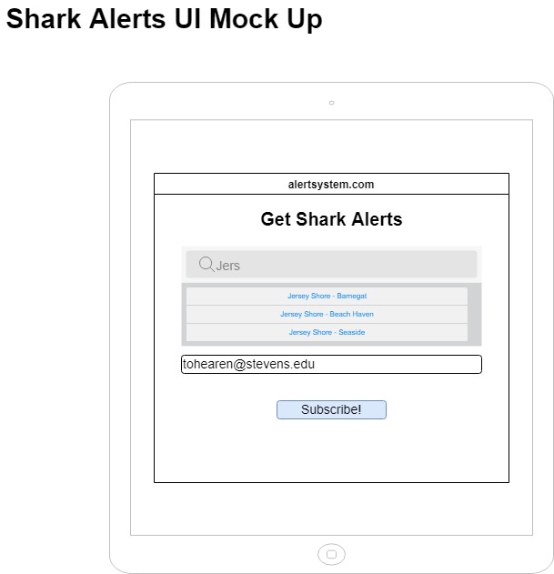
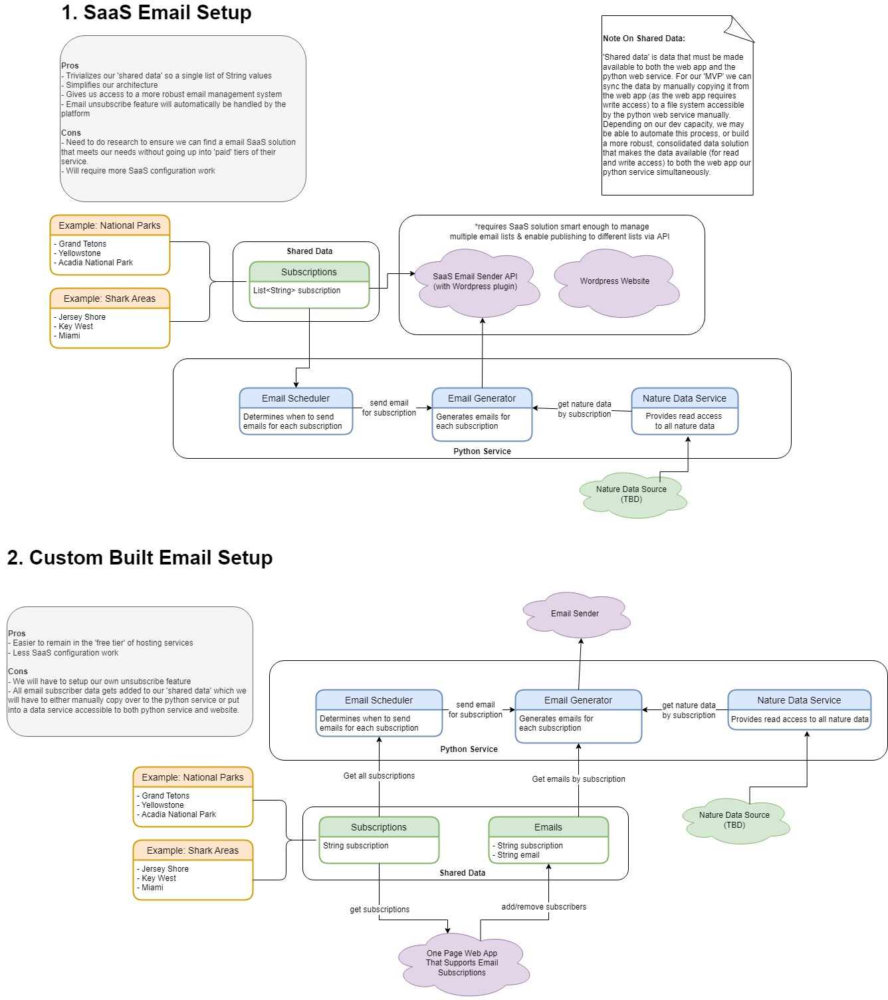

# JAWS
This project monitors the shark tracking database and alerts a user based on their location preferences. This application enables the users to register and set up shark alerts. The registered users get notified if a shark is sighted near the users' preferred location. This application also gives us a history of all the shark attacks that have happened in the past in the location that the user enters. This project also helps us to create awareness about Sharks. As Apex predators, Sharks also play an important role in the ecosystem by maintaining the species below them in the food chain and serving as an indicator for ocean health. We would also be adding information on different species of Sharks for the users to gain knowledge about sharks. We plan to partner with OCEARCH, a global non-profit organization, for our data needs. They offer open-source data sets for research and educational purposes.

## User Interface

## Architecture

## Back Test Status
 

Created by graduate students from Stevens University
